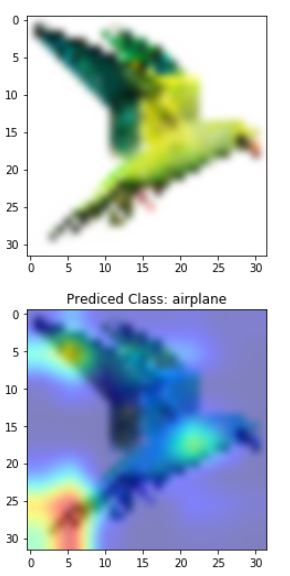
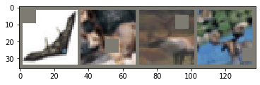
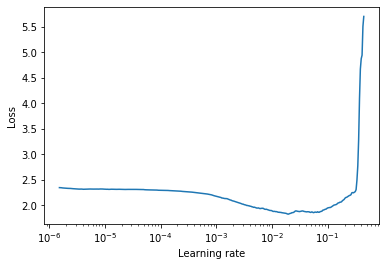
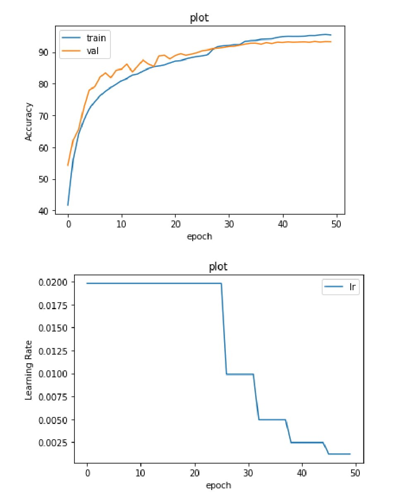
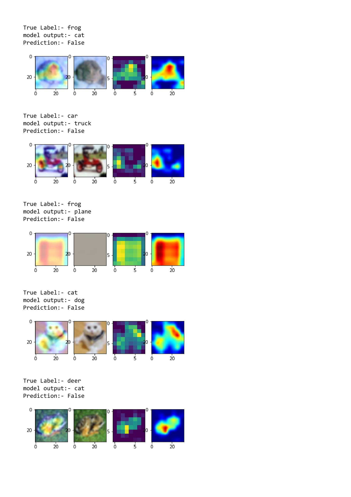
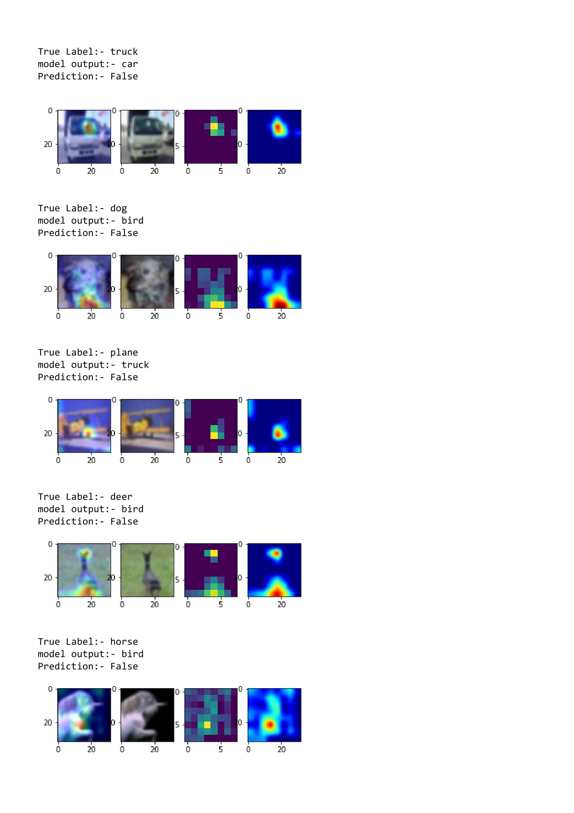
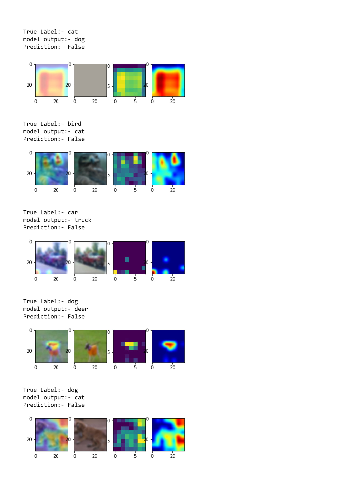
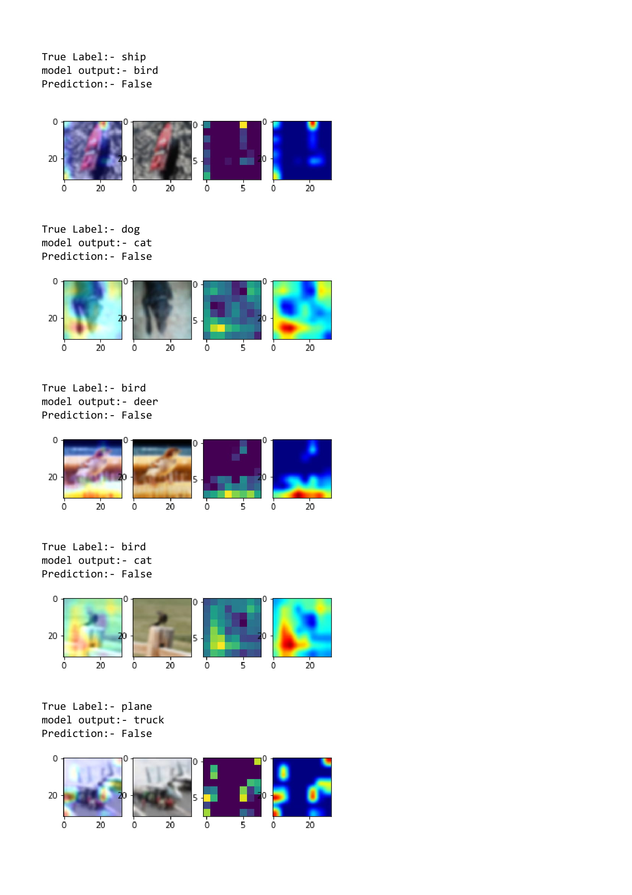
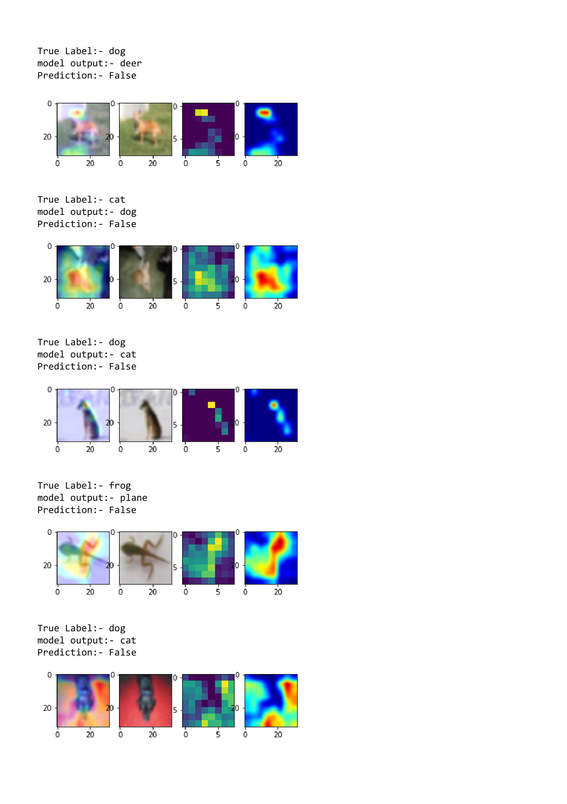

## Train CIFAR10 using ResNet18 V2 Using Data Augmentation + GradCAM + LR Finder + ReduceLROnPlateau

Train Accuracy: **95.53%**

Test Accuracy: **93.35%** (At Epoch=46)

Parameters: **11,172,042**

Used layer3(2nd last layer), not layer4 for **GradCAM**

**LR Finder + ReduceLROnPlateau** help to converge much faster


## Previous Benchmark Accuracy (Refernce: Mish github repo)

Benchmark accuracy with Mish: 89.2% <br/>
Benchmark accuracy With Relu: 87.5% 


## Data Augmentation Strategy **Cutout** inspired from GradCam Result

Model misunderstood bird's tail as plane'tail & misclassified as plane.



Therefor I used Cutout data augmentation which randomly crop image & force model to learn other feature of plane apart from tail e.g. cockpit, jet engine 



## LR Finder
Accoding to **LRFinder**, Loss minimum at **lr = 0.0198** (Good starting point) <br/>
Only trainloader is used (not val_loader) to decide best initial lr value <br/>


## ReduceLROnPlateau
As a metric , **training_loss** used rather than val_loss 
```python
scheduler = ReduceLROnPlateau(optimizer, mode='min', factor=0.5, patience=4, verbose=False,threshold=0.1, min_lr=1e-4)
scheduler.step(training_loss)
```

## Train/Test Acccuracy Graph


## 25 Misclassified Image on GradCAM






## Training Logs

```
0%|          | 0/391 [00:00<?, ?it/s]
EPOCH: 0
Loss=1.1620151996612549 Batch_id=390 Accuracy=41.75: 100%|██████████| 391/391 [00:16<00:00, 25.45it/s]
Mean Training_loss for a epoch:  1.5884404761711959

  0%|          | 0/391 [00:00<?, ?it/s]

Test set: Average loss: 0.0099, Accuracy: 5431/10000 (54.31%)


  ~~~~~~~~~~~~~~~~~~~~~~~~~~~~~~~~~~~~~~~~~~~~~~~~ 
At epoch:1, Learning rate =0.019800455987962512 
EPOCH: 1
Loss=1.2447547912597656 Batch_id=390 Accuracy=56.28: 100%|██████████| 391/391 [00:16<00:00, 25.60it/s]
Mean Training_loss for a epoch:  1.4052014897394058

  0%|          | 0/391 [00:00<?, ?it/s]

Test set: Average loss: 0.0083, Accuracy: 6230/10000 (62.30%)


  ~~~~~~~~~~~~~~~~~~~~~~~~~~~~~~~~~~~~~~~~~~~~~~~~ 
At epoch:2, Learning rate =0.019800455987962512 
EPOCH: 2
Loss=0.8828369975090027 Batch_id=390 Accuracy=63.99: 100%|██████████| 391/391 [00:16<00:00, 25.87it/s]
Mean Training_loss for a epoch:  1.278881253844535

  0%|          | 0/391 [00:00<?, ?it/s]

Test set: Average loss: 0.0085, Accuracy: 6552/10000 (65.52%)


  ~~~~~~~~~~~~~~~~~~~~~~~~~~~~~~~~~~~~~~~~~~~~~~~~ 
At epoch:3, Learning rate =0.019800455987962512 
EPOCH: 3
Loss=0.894365668296814 Batch_id=390 Accuracy=68.63: 100%|██████████| 391/391 [00:16<00:00, 25.31it/s] 
Mean Training_loss for a epoch:  1.184701969137277
  0%|          | 0/391 [00:00<?, ?it/s]

Test set: Average loss: 0.0069, Accuracy: 7258/10000 (72.58%)


  ~~~~~~~~~~~~~~~~~~~~~~~~~~~~~~~~~~~~~~~~~~~~~~~~ 
At epoch:4, Learning rate =0.019800455987962512 
EPOCH: 4
Loss=0.7899473905563354 Batch_id=390 Accuracy=72.06: 100%|██████████| 391/391 [00:16<00:00, 25.37it/s]
Mean Training_loss for a epoch:  1.1102563267930998

  0%|          | 0/391 [00:00<?, ?it/s]

Test set: Average loss: 0.0052, Accuracy: 7800/10000 (78.00%)


  ~~~~~~~~~~~~~~~~~~~~~~~~~~~~~~~~~~~~~~~~~~~~~~~~ 
At epoch:5, Learning rate =0.019800455987962512 
EPOCH: 5
Loss=0.5631783604621887 Batch_id=390 Accuracy=74.30: 100%|██████████| 391/391 [00:16<00:00, 25.51it/s]
Mean Training_loss for a epoch:  1.0495063269102767
  0%|          | 0/391 [00:00<?, ?it/s]

Test set: Average loss: 0.0051, Accuracy: 7902/10000 (79.02%)


  ~~~~~~~~~~~~~~~~~~~~~~~~~~~~~~~~~~~~~~~~~~~~~~~~ 
At epoch:6, Learning rate =0.019800455987962512 
EPOCH: 6
Loss=0.8292657732963562 Batch_id=390 Accuracy=76.14: 100%|██████████| 391/391 [00:16<00:00, 25.37it/s] 
Mean Training_loss for a epoch:  0.9985237537965227
  0%|          | 0/391 [00:00<?, ?it/s]

Test set: Average loss: 0.0041, Accuracy: 8201/10000 (82.01%)


  ~~~~~~~~~~~~~~~~~~~~~~~~~~~~~~~~~~~~~~~~~~~~~~~~ 
At epoch:7, Learning rate =0.019800455987962512 
EPOCH: 7
Loss=0.7975912094116211 Batch_id=390 Accuracy=77.62: 100%|██████████| 391/391 [00:16<00:00, 25.38it/s] 
Mean Training_loss for a epoch:  0.9548768221931841

  0%|          | 0/391 [00:00<?, ?it/s]

Test set: Average loss: 0.0039, Accuracy: 8342/10000 (83.42%)


  ~~~~~~~~~~~~~~~~~~~~~~~~~~~~~~~~~~~~~~~~~~~~~~~~ 
At epoch:8, Learning rate =0.019800455987962512 
EPOCH: 8
Loss=0.7256870269775391 Batch_id=390 Accuracy=78.77: 100%|██████████| 391/391 [00:16<00:00, 25.59it/s] 
Mean Training_loss for a epoch:  0.9173801381010737
  0%|          | 0/391 [00:00<?, ?it/s]

Test set: Average loss: 0.0042, Accuracy: 8184/10000 (81.84%)


  ~~~~~~~~~~~~~~~~~~~~~~~~~~~~~~~~~~~~~~~~~~~~~~~~ 
At epoch:9, Learning rate =0.019800455987962512 
EPOCH: 9
Loss=0.5261646509170532 Batch_id=390 Accuracy=79.81: 100%|██████████| 391/391 [00:16<00:00, 25.52it/s] 
Mean Training_loss for a epoch:  0.8841435816281896

  0%|          | 0/391 [00:00<?, ?it/s]

Test set: Average loss: 0.0036, Accuracy: 8424/10000 (84.24%)


  ~~~~~~~~~~~~~~~~~~~~~~~~~~~~~~~~~~~~~~~~~~~~~~~~ 
At epoch:10, Learning rate =0.019800455987962512 
EPOCH: 10
Loss=0.431693971157074 Batch_id=390 Accuracy=80.96: 100%|██████████| 391/391 [00:16<00:00, 25.42it/s]  
Mean Training_loss for a epoch:  0.8539548159906737

  0%|          | 0/391 [00:00<?, ?it/s]

Test set: Average loss: 0.0037, Accuracy: 8459/10000 (84.59%)


  ~~~~~~~~~~~~~~~~~~~~~~~~~~~~~~~~~~~~~~~~~~~~~~~~ 
At epoch:11, Learning rate =0.019800455987962512 
EPOCH: 11
Loss=0.31000077724456787 Batch_id=390 Accuracy=81.60: 100%|██████████| 391/391 [00:16<00:00, 25.49it/s]
Mean Training_loss for a epoch:  0.8272252388597043

  0%|          | 0/391 [00:00<?, ?it/s]

Test set: Average loss: 0.0033, Accuracy: 8619/10000 (86.19%)


  ~~~~~~~~~~~~~~~~~~~~~~~~~~~~~~~~~~~~~~~~~~~~~~~~ 
At epoch:12, Learning rate =0.019800455987962512 
EPOCH: 12
Loss=0.7295156717300415 Batch_id=390 Accuracy=82.69: 100%|██████████| 391/391 [00:16<00:00, 25.42it/s] 
Mean Training_loss for a epoch:  0.8023540158511474

  0%|          | 0/391 [00:00<?, ?it/s]

Test set: Average loss: 0.0040, Accuracy: 8369/10000 (83.69%)


  ~~~~~~~~~~~~~~~~~~~~~~~~~~~~~~~~~~~~~~~~~~~~~~~~ 
At epoch:13, Learning rate =0.019800455987962512 
EPOCH: 13
Loss=0.6178073883056641 Batch_id=390 Accuracy=83.03: 100%|██████████| 391/391 [00:16<00:00, 25.35it/s] 
Mean Training_loss for a epoch:  0.7801767040233261

  0%|          | 0/391 [00:00<?, ?it/s]

Test set: Average loss: 0.0036, Accuracy: 8546/10000 (85.46%)


  ~~~~~~~~~~~~~~~~~~~~~~~~~~~~~~~~~~~~~~~~~~~~~~~~ 
At epoch:14, Learning rate =0.019800455987962512 
EPOCH: 14
Loss=0.41346392035484314 Batch_id=390 Accuracy=83.99: 100%|██████████| 391/391 [00:16<00:00, 25.59it/s]
Mean Training_loss for a epoch:  0.7592402254020874

  0%|          | 0/391 [00:00<?, ?it/s]

Test set: Average loss: 0.0030, Accuracy: 8745/10000 (87.45%)


  ~~~~~~~~~~~~~~~~~~~~~~~~~~~~~~~~~~~~~~~~~~~~~~~~ 
At epoch:15, Learning rate =0.019800455987962512 
EPOCH: 15
Loss=0.604680061340332 Batch_id=390 Accuracy=84.74: 100%|██████████| 391/391 [00:16<00:00, 25.59it/s]  
Mean Training_loss for a epoch:  0.7395386826747176
  0%|          | 0/391 [00:00<?, ?it/s]

Test set: Average loss: 0.0033, Accuracy: 8623/10000 (86.23%)


  ~~~~~~~~~~~~~~~~~~~~~~~~~~~~~~~~~~~~~~~~~~~~~~~~ 
At epoch:16, Learning rate =0.019800455987962512 
EPOCH: 16
Loss=0.27985748648643494 Batch_id=390 Accuracy=85.32: 100%|██████████| 391/391 [00:16<00:00, 23.74it/s]
Mean Training_loss for a epoch:  0.7212178505586111

  0%|          | 0/391 [00:00<?, ?it/s]

Test set: Average loss: 0.0034, Accuracy: 8540/10000 (85.40%)


  ~~~~~~~~~~~~~~~~~~~~~~~~~~~~~~~~~~~~~~~~~~~~~~~~ 
At epoch:17, Learning rate =0.019800455987962512 
EPOCH: 17
Loss=0.5825625658035278 Batch_id=390 Accuracy=85.57: 100%|██████████| 391/391 [00:16<00:00, 25.74it/s] 
Mean Training_loss for a epoch:  0.7042864136827639

  0%|          | 0/391 [00:00<?, ?it/s]

Test set: Average loss: 0.0028, Accuracy: 8874/10000 (88.74%)


  ~~~~~~~~~~~~~~~~~~~~~~~~~~~~~~~~~~~~~~~~~~~~~~~~ 
At epoch:18, Learning rate =0.019800455987962512 
EPOCH: 18
Loss=0.38374564051628113 Batch_id=390 Accuracy=85.91: 100%|██████████| 391/391 [00:16<00:00, 25.52it/s]
Mean Training_loss for a epoch:  0.68848945770695
  0%|          | 0/391 [00:00<?, ?it/s]

Test set: Average loss: 0.0027, Accuracy: 8897/10000 (88.97%)


  ~~~~~~~~~~~~~~~~~~~~~~~~~~~~~~~~~~~~~~~~~~~~~~~~ 
At epoch:19, Learning rate =0.019800455987962512 
EPOCH: 19
Loss=0.35946792364120483 Batch_id=390 Accuracy=86.57: 100%|██████████| 391/391 [00:16<00:00, 25.55it/s]
Mean Training_loss for a epoch:  0.6736835687571322

  0%|          | 0/391 [00:00<?, ?it/s]

Test set: Average loss: 0.0030, Accuracy: 8779/10000 (87.79%)


  ~~~~~~~~~~~~~~~~~~~~~~~~~~~~~~~~~~~~~~~~~~~~~~~~ 
At epoch:20, Learning rate =0.019800455987962512 
EPOCH: 20
Loss=0.33323565125465393 Batch_id=390 Accuracy=87.14: 100%|██████████| 391/391 [00:16<00:00, 25.32it/s]
Mean Training_loss for a epoch:  0.6593434366561683

  0%|          | 0/391 [00:00<?, ?it/s]

Test set: Average loss: 0.0027, Accuracy: 8884/10000 (88.84%)


  ~~~~~~~~~~~~~~~~~~~~~~~~~~~~~~~~~~~~~~~~~~~~~~~~ 
At epoch:21, Learning rate =0.019800455987962512 
EPOCH: 21
Loss=0.36111190915107727 Batch_id=390 Accuracy=87.29: 100%|██████████| 391/391 [00:16<00:00, 25.68it/s]
Mean Training_loss for a epoch:  0.6461516148463788

  0%|          | 0/391 [00:00<?, ?it/s]

Test set: Average loss: 0.0026, Accuracy: 8948/10000 (89.48%)


  ~~~~~~~~~~~~~~~~~~~~~~~~~~~~~~~~~~~~~~~~~~~~~~~~ 
At epoch:22, Learning rate =0.019800455987962512 
EPOCH: 22
Loss=0.46574774384498596 Batch_id=390 Accuracy=87.76: 100%|██████████| 391/391 [00:16<00:00, 25.28it/s]
Mean Training_loss for a epoch:  0.6335647821270636

  0%|          | 0/391 [00:00<?, ?it/s]

Test set: Average loss: 0.0027, Accuracy: 8895/10000 (88.95%)


  ~~~~~~~~~~~~~~~~~~~~~~~~~~~~~~~~~~~~~~~~~~~~~~~~ 
At epoch:23, Learning rate =0.019800455987962512 
EPOCH: 23
Loss=0.4786052703857422 Batch_id=390 Accuracy=88.19: 100%|██████████| 391/391 [00:16<00:00, 25.77it/s] 
Mean Training_loss for a epoch:  0.6213551695265657

  0%|          | 0/391 [00:00<?, ?it/s]

Test set: Average loss: 0.0026, Accuracy: 8932/10000 (89.32%)


  ~~~~~~~~~~~~~~~~~~~~~~~~~~~~~~~~~~~~~~~~~~~~~~~~ 
At epoch:24, Learning rate =0.019800455987962512 
EPOCH: 24
Loss=0.36071792244911194 Batch_id=390 Accuracy=88.52: 100%|██████████| 391/391 [00:16<00:00, 25.62it/s]
Mean Training_loss for a epoch:  0.6098437100420218

  0%|          | 0/391 [00:00<?, ?it/s]

Test set: Average loss: 0.0027, Accuracy: 8974/10000 (89.74%)


  ~~~~~~~~~~~~~~~~~~~~~~~~~~~~~~~~~~~~~~~~~~~~~~~~ 
At epoch:25, Learning rate =0.019800455987962512 
EPOCH: 25
Loss=0.28758805990219116 Batch_id=390 Accuracy=88.75: 100%|██████████| 391/391 [00:16<00:00, 25.45it/s]
Mean Training_loss for a epoch:  0.5987865745261994

  0%|          | 0/391 [00:00<?, ?it/s]

Test set: Average loss: 0.0025, Accuracy: 9041/10000 (90.41%)


  ~~~~~~~~~~~~~~~~~~~~~~~~~~~~~~~~~~~~~~~~~~~~~~~~ 
At epoch:26, Learning rate =0.019800455987962512 
EPOCH: 26
Loss=0.36435210704803467 Batch_id=390 Accuracy=89.07: 100%|██████████| 391/391 [00:16<00:00, 25.23it/s]
Mean Training_loss for a epoch:  0.5883525867045823

  0%|          | 0/391 [00:00<?, ?it/s]

Test set: Average loss: 0.0025, Accuracy: 9061/10000 (90.61%)


  ~~~~~~~~~~~~~~~~~~~~~~~~~~~~~~~~~~~~~~~~~~~~~~~~ 
At epoch:27, Learning rate =0.009900227993981256 
EPOCH: 27
Loss=0.19524192810058594 Batch_id=390 Accuracy=90.84: 100%|██████████| 391/391 [00:16<00:00, 25.24it/s]
Mean Training_loss for a epoch:  0.5766209169778569

  0%|          | 0/391 [00:00<?, ?it/s]

Test set: Average loss: 0.0022, Accuracy: 9104/10000 (91.04%)


  ~~~~~~~~~~~~~~~~~~~~~~~~~~~~~~~~~~~~~~~~~~~~~~~~ 
At epoch:28, Learning rate =0.009900227993981256 
EPOCH: 28
Loss=0.24702081084251404 Batch_id=390 Accuracy=91.69: 100%|██████████| 391/391 [00:16<00:00, 25.40it/s]
Mean Training_loss for a epoch:  0.5649583116213168

  0%|          | 0/391 [00:00<?, ?it/s]

Test set: Average loss: 0.0022, Accuracy: 9118/10000 (91.18%)


  ~~~~~~~~~~~~~~~~~~~~~~~~~~~~~~~~~~~~~~~~~~~~~~~~ 
At epoch:29, Learning rate =0.009900227993981256 
EPOCH: 29
Loss=0.2738533616065979 Batch_id=390 Accuracy=91.95: 100%|██████████| 391/391 [00:16<00:00, 25.54it/s] 
Mean Training_loss for a epoch:  0.5539668888406223
  0%|          | 0/391 [00:00<?, ?it/s]

Test set: Average loss: 0.0022, Accuracy: 9138/10000 (91.38%)


  ~~~~~~~~~~~~~~~~~~~~~~~~~~~~~~~~~~~~~~~~~~~~~~~~ 
At epoch:30, Learning rate =0.009900227993981256 
EPOCH: 30
Loss=0.22458556294441223 Batch_id=390 Accuracy=92.04: 100%|██████████| 391/391 [00:16<00:00, 25.64it/s]
Mean Training_loss for a epoch:  0.5434141746523081

  0%|          | 0/391 [00:00<?, ?it/s]

Test set: Average loss: 0.0022, Accuracy: 9170/10000 (91.70%)


  ~~~~~~~~~~~~~~~~~~~~~~~~~~~~~~~~~~~~~~~~~~~~~~~~ 
At epoch:31, Learning rate =0.009900227993981256 
EPOCH: 31
Loss=0.18728230893611908 Batch_id=390 Accuracy=92.31: 100%|██████████| 391/391 [00:16<00:00, 25.53it/s]
Mean Training_loss for a epoch:  0.5333350347092999

  0%|          | 0/391 [00:00<?, ?it/s]

Test set: Average loss: 0.0022, Accuracy: 9177/10000 (91.77%)


  ~~~~~~~~~~~~~~~~~~~~~~~~~~~~~~~~~~~~~~~~~~~~~~~~ 
At epoch:32, Learning rate =0.009900227993981256 
EPOCH: 32
Loss=0.5041451454162598 Batch_id=390 Accuracy=92.32: 100%|██████████| 391/391 [00:16<00:00, 25.65it/s] 
Mean Training_loss for a epoch:  0.5238271371727719

  0%|          | 0/391 [00:00<?, ?it/s]

Test set: Average loss: 0.0021, Accuracy: 9214/10000 (92.14%)


  ~~~~~~~~~~~~~~~~~~~~~~~~~~~~~~~~~~~~~~~~~~~~~~~~ 
At epoch:33, Learning rate =0.004950113996990628 
EPOCH: 33
Loss=0.287034809589386 Batch_id=390 Accuracy=93.36: 100%|██████████| 391/391 [00:16<00:00, 25.52it/s]  
Mean Training_loss for a epoch:  0.5140804900073621
  0%|          | 0/391 [00:00<?, ?it/s]

Test set: Average loss: 0.0020, Accuracy: 9247/10000 (92.47%)


  ~~~~~~~~~~~~~~~~~~~~~~~~~~~~~~~~~~~~~~~~~~~~~~~~ 
At epoch:34, Learning rate =0.004950113996990628 
EPOCH: 34
Loss=0.10890035331249237 Batch_id=390 Accuracy=93.57: 100%|██████████| 391/391 [00:16<00:00, 25.35it/s]
Mean Training_loss for a epoch:  0.5046629398435104

  0%|          | 0/391 [00:00<?, ?it/s]

Test set: Average loss: 0.0019, Accuracy: 9277/10000 (92.77%)


  ~~~~~~~~~~~~~~~~~~~~~~~~~~~~~~~~~~~~~~~~~~~~~~~~ 
At epoch:35, Learning rate =0.004950113996990628 
EPOCH: 35
Loss=0.1309397965669632 Batch_id=390 Accuracy=93.62: 100%|██████████| 391/391 [00:16<00:00, 25.33it/s] 
Mean Training_loss for a epoch:  0.49564165627765416

  0%|          | 0/391 [00:00<?, ?it/s]

Test set: Average loss: 0.0019, Accuracy: 9280/10000 (92.80%)


  ~~~~~~~~~~~~~~~~~~~~~~~~~~~~~~~~~~~~~~~~~~~~~~~~ 
At epoch:36, Learning rate =0.004950113996990628 
EPOCH: 36
Loss=0.1897353231906891 Batch_id=390 Accuracy=93.99: 100%|██████████| 391/391 [00:16<00:00, 25.32it/s] 
Mean Training_loss for a epoch:  0.4869104722376856

  0%|          | 0/391 [00:00<?, ?it/s]

Test set: Average loss: 0.0021, Accuracy: 9245/10000 (92.45%)


  ~~~~~~~~~~~~~~~~~~~~~~~~~~~~~~~~~~~~~~~~~~~~~~~~ 
At epoch:37, Learning rate =0.004950113996990628 
EPOCH: 37
Loss=0.0666598379611969 Batch_id=390 Accuracy=94.05: 100%|██████████| 391/391 [00:16<00:00, 25.49it/s] 
Mean Training_loss for a epoch:  0.4785956093352722

  0%|          | 0/391 [00:00<?, ?it/s]

Test set: Average loss: 0.0019, Accuracy: 9298/10000 (92.98%)


  ~~~~~~~~~~~~~~~~~~~~~~~~~~~~~~~~~~~~~~~~~~~~~~~~ 
At epoch:38, Learning rate =0.004950113996990628 
EPOCH: 38
Loss=0.14493080973625183 Batch_id=390 Accuracy=94.12: 100%|██████████| 391/391 [00:16<00:00, 25.49it/s]
Mean Training_loss for a epoch:  0.4706449635662527
  0%|          | 0/391 [00:00<?, ?it/s]

Test set: Average loss: 0.0020, Accuracy: 9267/10000 (92.67%)


  ~~~~~~~~~~~~~~~~~~~~~~~~~~~~~~~~~~~~~~~~~~~~~~~~ 
At epoch:39, Learning rate =0.002475056998495314 
EPOCH: 39
Loss=0.16475407779216766 Batch_id=390 Accuracy=94.56: 100%|██████████| 391/391 [00:16<00:00, 25.56it/s] 
Mean Training_loss for a epoch:  0.4627252043655995

  0%|          | 0/391 [00:00<?, ?it/s]

Test set: Average loss: 0.0019, Accuracy: 9312/10000 (93.12%)


  ~~~~~~~~~~~~~~~~~~~~~~~~~~~~~~~~~~~~~~~~~~~~~~~~ 
At epoch:40, Learning rate =0.002475056998495314 
EPOCH: 40
Loss=0.15318706631660461 Batch_id=390 Accuracy=94.82: 100%|██████████| 391/391 [00:16<00:00, 25.48it/s]
Mean Training_loss for a epoch:  0.4551092741706417

  0%|          | 0/391 [00:00<?, ?it/s]

Test set: Average loss: 0.0019, Accuracy: 9302/10000 (93.02%)


  ~~~~~~~~~~~~~~~~~~~~~~~~~~~~~~~~~~~~~~~~~~~~~~~~ 
At epoch:41, Learning rate =0.002475056998495314 
EPOCH: 41
Loss=0.1670120805501938 Batch_id=390 Accuracy=94.92: 100%|██████████| 391/391 [00:16<00:00, 23.88it/s]  
Mean Training_loss for a epoch:  0.44772677707157266

  0%|          | 0/391 [00:00<?, ?it/s]

Test set: Average loss: 0.0020, Accuracy: 9322/10000 (93.22%)


  ~~~~~~~~~~~~~~~~~~~~~~~~~~~~~~~~~~~~~~~~~~~~~~~~ 
At epoch:42, Learning rate =0.002475056998495314 
EPOCH: 42
Loss=0.08455505222082138 Batch_id=390 Accuracy=94.90: 100%|██████████| 391/391 [00:16<00:00, 25.89it/s] 
Mean Training_loss for a epoch:  0.4406877038533429

  0%|          | 0/391 [00:00<?, ?it/s]

Test set: Average loss: 0.0019, Accuracy: 9309/10000 (93.09%)


  ~~~~~~~~~~~~~~~~~~~~~~~~~~~~~~~~~~~~~~~~~~~~~~~~ 
At epoch:43, Learning rate =0.002475056998495314 
EPOCH: 43
Loss=0.10510843992233276 Batch_id=390 Accuracy=94.91: 100%|██████████| 391/391 [00:16<00:00, 25.15it/s] 
Mean Training_loss for a epoch:  0.43397918484942205

  0%|          | 0/391 [00:00<?, ?it/s]

Test set: Average loss: 0.0019, Accuracy: 9317/10000 (93.17%)


  ~~~~~~~~~~~~~~~~~~~~~~~~~~~~~~~~~~~~~~~~~~~~~~~~ 
At epoch:44, Learning rate =0.002475056998495314 
EPOCH: 44
Loss=0.19483612477779388 Batch_id=390 Accuracy=94.95: 100%|██████████| 391/391 [00:16<00:00, 25.60it/s] 
Mean Training_loss for a epoch:  0.4275860528555588
  0%|          | 0/391 [00:00<?, ?it/s]

Test set: Average loss: 0.0019, Accuracy: 9323/10000 (93.23%)


  ~~~~~~~~~~~~~~~~~~~~~~~~~~~~~~~~~~~~~~~~~~~~~~~~ 
At epoch:45, Learning rate =0.002475056998495314 
EPOCH: 45
Loss=0.3161902129650116 Batch_id=390 Accuracy=95.17: 100%|██████████| 391/391 [00:16<00:00, 23.86it/s]  
Mean Training_loss for a epoch:  0.4213411118721294

  0%|          | 0/391 [00:00<?, ?it/s]

Test set: Average loss: 0.0019, Accuracy: 9309/10000 (93.09%)


  ~~~~~~~~~~~~~~~~~~~~~~~~~~~~~~~~~~~~~~~~~~~~~~~~ 
At epoch:46, Learning rate =0.001237528499247657 
EPOCH: 46
Loss=0.04599720239639282 Batch_id=390 Accuracy=95.17: 100%|██████████| 391/391 [00:16<00:00, 25.36it/s] 
Mean Training_loss for a epoch:  0.4153074842675529
  0%|          | 0/391 [00:00<?, ?it/s]

Test set: Average loss: 0.0019, Accuracy: 9335/10000 (93.35%)


  ~~~~~~~~~~~~~~~~~~~~~~~~~~~~~~~~~~~~~~~~~~~~~~~~ 
At epoch:47, Learning rate =0.001237528499247657 
EPOCH: 47
Loss=0.11014282703399658 Batch_id=390 Accuracy=95.40: 100%|██████████| 391/391 [00:16<00:00, 25.81it/s] 
Mean Training_loss for a epoch:  0.4094068077333329

  0%|          | 0/391 [00:00<?, ?it/s]

Test set: Average loss: 0.0019, Accuracy: 9315/10000 (93.15%)


  ~~~~~~~~~~~~~~~~~~~~~~~~~~~~~~~~~~~~~~~~~~~~~~~~ 
At epoch:48, Learning rate =0.001237528499247657 
EPOCH: 48
Loss=0.1541607826948166 Batch_id=390 Accuracy=95.53: 100%|██████████| 391/391 [00:16<00:00, 25.53it/s]  
Mean Training_loss for a epoch:  0.4036742802780312

  0%|          | 0/391 [00:00<?, ?it/s]

Test set: Average loss: 0.0019, Accuracy: 9331/10000 (93.31%)


  ~~~~~~~~~~~~~~~~~~~~~~~~~~~~~~~~~~~~~~~~~~~~~~~~ 
At epoch:49, Learning rate =0.001237528499247657 
EPOCH: 49
Loss=0.18307188153266907 Batch_id=390 Accuracy=95.37: 100%|██████████| 391/391 [00:16<00:00, 25.55it/s] 
Mean Training_loss for a epoch:  0.3982297283982682


Test set: Average loss: 0.0019, Accuracy: 9327/10000 (93.27%)


  ~~~~~~~~~~~~~~~~~~~~~~~~~~~~~~~~~~~~~~~~~~~~~~~~ 
At epoch:50, Learning rate =0.001237528499247657 
```
